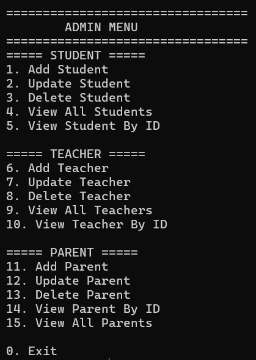

# 🎓 College Management System

## Overview

The College Management System is a Java-based backend application designed to manage academic records through role-based access control. The system provides separate interfaces and permissions for administrators, teachers, students, and parents, ensuring that each user can only access the information relevant to their role.

The project follows a modular architecture using Java, JDBC, Maven, and MySQL while demonstrating practical implementation of Object-Oriented Programming concepts and database-driven application development.

---

# Features

### Role-Based Access Control

The application provides dedicated menus and permissions for different users.

### Administrator

* Full access to the system
* Manage student records
* Manage teacher records
* Manage parent records
* View complete database records

### Teacher

* View assigned students
* Add student marks
* Update marks
* Delete marks
* View academic records

### Student

* View personal profile
* View own academic records

### Parent

* View information of the associated child
* Access child's academic records

---

## Technologies Used

* Java
* JDBC
* MySQL
* Maven
* Object-Oriented Programming (OOP)

---

# Project Structure

```text
College-Management-System
│
├── src/
│   └── main/
│       └── java/
│           ├── config/
│           ├── dao/
│           ├── model/
│           ├── service/
│           ├── ui/
│           └── Main.java
│
├── database.sql
├── pom.xml
├── run.bat
├── .gitignore
└── README.md
```

---

# Application Workflow

```text
User Login
      │
      ▼
Role Authentication
      │
      ▼
Role-specific Menu
      │
      ▼
Business Logic
      │
      ▼
JDBC
      │
      ▼
MySQL Database
```

---

# Database

The application stores and manages information using MySQL.

Main entities include:

* Users
* Students
* Teachers
* Parents
* Marks

Relationships are maintained to ensure students are associated with their parents and academic records.

---

# Key Functionalities

* Student Management
* Teacher Management
* Parent Management
* Marks Management
* Role-Based Authorization
* CRUD Operations
* JDBC Database Connectivity

---

# Admin Dashboard

The administrator has complete control over the system and can perform operations related to students, teachers, and parents.

<p align="center">

</p>

---

# Concepts Demonstrated

This project demonstrates practical understanding of:

* Object-Oriented Programming
* JDBC
* MySQL
* Maven Project Structure
* Role-Based Access Control (RBAC)
* CRUD Operations
* Exception Handling
* Modular Software Design

---

# Getting Started

## Clone the repository

```bash
git clone https://github.com/Jatin-Sharma29/college-management-system.git
```

---

## Configure the Database

Create a MySQL database and import the provided SQL file.

```sql
CREATE DATABASE college_management;
```

Import:

```
database.sql
```

---

## Configure JDBC

Update the database credentials in the configuration file.

Example:

```java
String url = "jdbc:mysql://localhost:3306/college_management";
String username = "root";
String password = "your_password";
```

---

## Run

Using Maven:

```bash
mvn clean compile
mvn exec:java
```

or simply execute

```
run.bat
```

---

# Future Improvements

Some possible enhancements include:

* Password hashing
* Attendance management
* Fee management
* Report generation
* REST API using Spring Boot
* JavaFX desktop interface
* Unit testing with JUnit

---

# Author

**Jatin Sharma** \
**Anirudh Gupta** \
**Hardik Padha**

Thank you for checking out this project. Feedback and contributions are always welcome.
